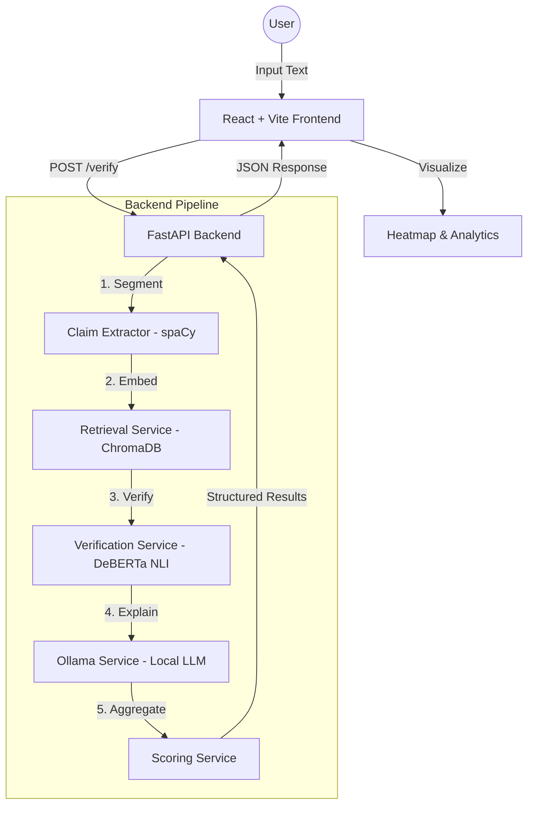

# TruthLens: AI Hallucination Detection & Verification Platform

TruthLens is a professional-grade, full-stack AI safety platform designed to detect and verify factual claims in AI-generated content. It acts as an intelligent verification layer for Large Language Models (LLMs), identifying hallucinations, retrieving supporting evidence, and providing natural language explanations for every claim.

---

## 🏗️ System Architecture

TruthLens follows a modular, service-oriented architecture designed for scalability and maintainability.

### 1. High-Level Overview


### 2. Detailed System Architecture & Data Flow

```text
       USER INTERFACE (React + Vite)
      +-------------------------------------------------------+
      |  [ Input Area ] -> [ Heatmap ] -> [ Analytics Chart ] |
      +------------+------------------------------------------+
                   |
           (A) POST /api/verify (JSON)
                   |
      +------------v------------------------------------------+
      |        FASTAPI BACKEND (Orchestration Layer)          |
      +------------+------------------------------------------+
                   |
      +------------v------------------------------------------+
      | 1. CLAIM EXTRACTION SERVICE                           |
      |    (spaCy NLP) - Identifies atomic factual claims     |
      +------------+------------------------------------------+
                   |
      +------------v------------------------------------------+
      | 2. RETRIEVAL SERVICE                                  |
      |    (ChromaDB + all-MiniLM-L6-v2)                      |
      |    - Searches Vector DB for supporting evidence       |
      +------------+------------------------------------------+
                   |
      +------------v------------------------------------------+
      | 3. VERIFICATION SERVICE                               |
      |    (DeBERTa-v3 NLI Model)                             |
      |    - Classifies relationship: Support vs Contradict   |
      +------------+------------------------------------------+
                   |
      +------------v------------------------------------------+
      | 4. EXPLAINABILITY SERVICE                             |
      |    (Ollama / Llama 3)                                 |
      |    - Generates human-readable reasoning for results   |
      +------------+------------------------------------------+
                   |
      +------------v------------------------------------------+
      | 5. SCORING & METADATA ENGINE                          |
      |    - Aggregates risk scores and tracks latency        |
      +------------+------------------------------------------+
                   |
           (B) Structured Response (Status, Evidence, Reasoning)
                   |
      +------------v------------------------------------------+
      |        FRONTEND VISUALIZATION                         |
      |  (Highlights risk directly on the original text)      |
      +-------------------------------------------------------+
```

### 3. Data Flow Logic

1.  **Input:** User pastes text into the **React** workspace.
2.  **Segmentation:** **spaCy** parses the text into claims with character offsets.
3.  **Context:** For each claim, **ChromaDB** retrieves the most semantically similar evidence from the vector database.
4.  **Inference:** The **DeBERTa** model compares the retrieved Evidence and the Claim to calculate a risk score.
5.  **Reasoning:** **Ollama** takes the result and generates a natural language explanation.
6.  **Output:** The **FastAPI** backend returns a JSON object containing the text, claims, evidence, AI reasoning, and performance benchmarks.

---

## 🚀 Key Features

### 🔍 1. Atomic Claim Extraction
Uses **spaCy** and custom NLP heuristics to break down complex text into individual, verifiable factual claims. It supports character-offset tracking for precise UI highlighting.

### 📚 2. Semantic Evidence Retrieval
Integrated with **ChromaDB** (Vector Database) and **Sentence-Transformers** (`all-MiniLM-L6-v2`). It performs vector similarity searches to find the most relevant evidence from a trusted corpus.

### ⚖️ 3. Semantic Verification (NLI)
Employs the **DeBERTa-v3-small** Natural Language Inference (NLI) model to classify the relationship between a claim and its evidence as:
*   **Supported:** Confirmed by evidence.
*   **Contradicted:** Explicitly refuted by evidence (High Risk).
*   **Insufficient Evidence:** No relevant data found.

### 🤖 4. Explainable AI (XAI) with Ollama
Integrates local LLMs (via **Ollama**) to generate human-readable reasoning. It explains *why* a claim was flagged, providing context beyond simple labels.

### 📊 5. Modern Visualization Suite
*   **Risk Heatmap:** Highlights source text based on verification status.
*   **Confidence Meter:** A visual gauge for overall response reliability.
*   **Analytics Dashboard:** Bar charts showing risk distribution across claims.
*   **Performance Metrics:** Detailed breakdown of processing time for every pipeline stage.

---

## 🛠️ Technology Stack

| Layer | Technologies |
| :--- | :--- |
| **Frontend** | React 19, Vite, Tailwind CSS, Recharts, Axios |
| **Backend** | FastAPI, Uvicorn, Pydantic |
| **NLP / AI** | spaCy, Sentence-Transformers, DeBERTa-v3 (NLI), Ollama |
| **Database** | ChromaDB (Vector DB) |
| **Dev Tools** | Pytest, ESLint, PowerShell Scripting |

---

## 🏃 Getting Started

### Prerequisites
1.  **Python 3.10+**
2.  **Node.js & npm**
3.  **Ollama** (Optional, for advanced reasoning)
    *   Install from [ollama.com](https://ollama.com)
    *   Run: `ollama pull llama3`

### Installation

1.  **Clone/Open the project directory.**
2.  **Backend Setup:**
    ```bash
    cd backend
    python -m venv venv
    ..\venv\Scripts\activate
    pip install -r requirements.txt
    python -m spacy download en_core_web_sm
    ```
3.  **Frontend Setup:**
    ```bash
    cd frontend
    npm install
    ```

### Running the Application

The easiest way to start both servers is using the provided PowerShell script:

1.  Open PowerShell in the root directory.
2.  Run the launcher:
    ```powershell
    powershell.exe -NoProfile -ExecutionPolicy Bypass -File .\launch.ps1
    ```

---

## 📂 Project Structure

```text
TruthLens/
├── backend/
│   ├── app/
│   │   ├── api/          # FastAPI Routes (Verify, Health)
│   │   ├── models/       # AI Model Wrappers (Embedding, Verifier)
│   │   ├── services/     # Business Logic (Extraction, Retrieval, NLI, Ollama)
│   │   ├── utils/        # Logging & Timing
│   │   └── main.py       # API Entry Point
│   └── tests/            # Pytest Suite
├── frontend/
│   ├── src/
│   │   ├── components/   # UI Modules (Heatmap, Meter, Cards)
│   │   ├── pages/        # Landing & Workspace Views
│   │   └── App.jsx       # Routing & Core Logic
│   └── tailwind.config.js
└── launch.ps1            # Unified Automation Script
```

---

## 📈 Optimization Details (Phase 7)
*   **Embedding Caching:** An LRU-style cache in `EmbeddingModel` prevents redundant model calls.
*   **Atomic Splitting:** Sentences are split on coordinating conjunctions to isolate distinct facts.
*   **Performance Tracking:** Every request returns a `metadata` object with millisecond-accurate timing for transparency.

---

**Developed for AI Reliability and Safety.**
© 2026 TruthLens AI.
